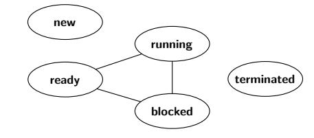

# Guía 1: Procesos y API del S.O.

## 1. ¿Cuáles son los pasos que deben llevarse a cabo para realizar un cambio de contexto? 
1. Guardar el contexto del proceso que estaba ejecutando en su PCB.
2. Restaurar desde la PCB el contexto del proceso que va a ejecutarse.

## 2. PCB
El PCB (Process Control Block) de un sistema operativo para una arquitectura de 16 bits es

```c
Todo es con respecto al proceso que va a ser desalojado.
    struct PCB {
        int STATUS;
        int P_ID; //ID del proceso
        int PC; //próxima instrucción a ejecutar
        int R0; //valor al momento de desalojar
        ...
        int R15; //valor del registro R15 al ser desalojado
        int CPU_TIME //tiempo de ejecución del proceso
    }

    Notar que hablamos de "al desalojar" para los registros, porque si fuese el activo los agarrás de registros, no de la PCB. 
```

1. Implementar la rutina *ke_context_switch(PCB* pcb_0, PCB* pcb_1)*, encargada de realizar el cambio de contexto entre dos procesos (cuyos programas ya han sido cargados en memoria) debido a que el primero ha consumido su *quantum*
*pcb_0* es el puntero al PCB del proceso a ser desalojado.
*pcb_1* es el puntero al PCB del proceso a ser ejecutado a continuación.

Para implementarla, se cuenta con un lenguaje que posee acceso a los registros de procesador R0, R1, ..., R15 y las siguientes operaciones
.=.; //asignación entre registros y memoria
int ke_current_user_time() // devuelve el valor del cronómetro.
void ke_reset_current_user_time() //resetea el cronómetro
void ret(); // desapila el tope de la pila y reemplaza el PC
void set_current_process(int pid) //asigna al proceso con el pid como el siguiente a ejecutarse.

```c
Preguntas:
¿Quién incrementa CPU_TIME?
¿En dónde tengo el PC? Como para agarrarlo.
¿Está bien asumir que el proceso a desalojar lo guardamos como ready porque se "acabó su quantum"? 
¿El orden de las operaciones es indistinto, sin contar el ret()? Porque supongo que si tenés el ret primero y no preparaste lo otro, rompiste todo. 
¿Los pasos que corresponden al paso 1, son los que necesita solo la CPU para seguir ejecutando? ¿O cosas como "CPU_TIME" realmente son importantes?

void ke_context_switch(PCB* pcb_0, PCB* pcb_1){
    //Preservo en la PCB_0 los valores de los registros
    pcb_0 -> R0 = R0;
    pcb_0 -> R1 = R1;
    ...
    pcb_0 -> R15 = R15;
    pcb_0 -> STAT = "KE_READY"; //xq se terminó su "quantum" entonces está listo para ser ejecutado luego de vuelta.
    pcb_0 -> CPU_TIME += ke_current_user_time();
    
    //Cargo el nuevo PID
    set_current_process(pcb_1 -> P_ID);

    //Cambio el STAT del nuevo proceso
    pcb_1 -> STAT = "KE_RUNNING";

    //Cargo los nuevos registros
    R0 = pcb_1 -> R0;
    R1 = pcb_1 -> R1;
    ...
    R15 = pcb_1 -> R15;

    //Reseteo el CPU_TIME
    ke_reset_current_user_time();

    //Reemplaza el PC
    ret();
}
```

2. Identificar en el programa escrito cuáles son los pasos del ejercicio 1.

Nos interesan aquellos pasos que afectan a la ejecución en la CPU para que el proceso pueda continuar exactamente donde estaba.
Por lo tanto, los pasos del ejercicio 1 son: 
- Preservar Contexto: PC, R0...R15
- Restaurar Contexto: R0...R15, PC.

## Ejercicio 3: Describir la diferencia entre un system call y una llamada a una función de biblioteca
Una llamada a función de biblioteca es una llamada a código que forma parte de una biblioteca y normalmente comienza/ejecuta en user space. 

Una system call es el mecanismo mediante el cual un proceso solicita un servicio al kernel, provocando una transición controlada de user mode a kernel mode. 

Una función de biblioteca puede o no realizar internamente una system call.

## Ejercicio 4.
En el esquema de transición de estados que se incluye a continuación:



a) Dibujar las puntas de flechas que correspondan.
    - New
        -> Ready (crear el proceso)
    - Ready
        -> Running (ejecutar el proceso)
    - Running
        -> Ready (proceso perdió su quantum)
        -> Blocked (debe esperar algo para seguir ejecutando)
        -> Terminated (terminó su ejecución)
    - Blocked
        -> Ready (recibió lo que necesitaba para seguir ejecutando)
b) Explicar qué causa cada transición y qué componentes *(scheduler, proceso, etc.)* estarían involucrados.

Preguntar:
1. ¿Qué pasa en el caso de que en la PCB el proceso está BLOCKED pero un padre te tira un SIGTERM? ¿No pasaría de BLOCKED a TERMINATED? Para mí faltan flechas o este es un modelo simplificado que "asume que termina" solo si antes estaba running.