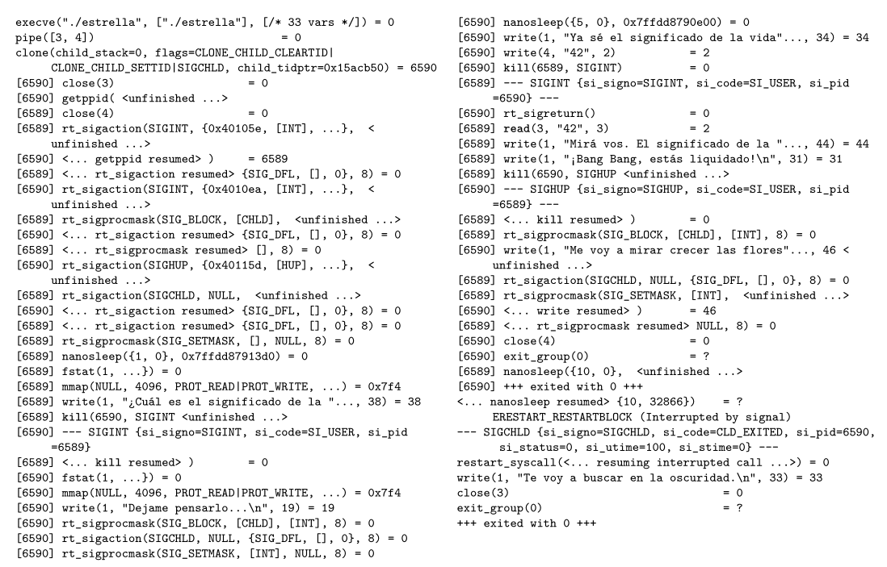

# Guía 1: Procesos y API del S.O.

## 1. ¿Cuáles son los pasos que deben llevarse a cabo para realizar un cambio de contexto? 
1. Guardar el contexto del proceso que estaba ejecutando en su PCB.
2. Restaurar desde la PCB el contexto del proceso que va a ejecutarse.

## 2. PCB
El PCB (Process Control Block) de un sistema operativo para una arquitectura de 16 bits es

```c
Todo es con respecto al proceso que va a ser desalojado.
    struct PCB {
        int STATUS;
        int P_ID; //ID del proceso
        int PC; //próxima instrucción a ejecutar
        int R0; //valor al momento de desalojar
        ...
        int R15; //valor del registro R15 al ser desalojado
        int CPU_TIME //tiempo de ejecución del proceso
    }

    Notar que hablamos de "al desalojar" para los registros, porque si fuese el activo los agarrás de registros, no de la PCB. 
```

1. Implementar la rutina *ke_context_switch(PCB* pcb_0, PCB* pcb_1)*, encargada de realizar el cambio de contexto entre dos procesos (cuyos programas ya han sido cargados en memoria) debido a que el primero ha consumido su *quantum*
*pcb_0* es el puntero al PCB del proceso a ser desalojado.
*pcb_1* es el puntero al PCB del proceso a ser ejecutado a continuación.

Para implementarla, se cuenta con un lenguaje que posee acceso a los registros de procesador R0, R1, ..., R15 y las siguientes operaciones
1. .=.; //asignación entre registros y memoria
2. int ke_current_user_time() // devuelve el valor del cronómetro.
3. void ke_reset_current_user_time() //resetea el cronómetro
4. void ret(); // desapila el tope de la pila y reemplaza el PC
5. void set_current_process(int pid) //asigna al proceso con el pid como el siguiente a ejecutarse.

```c
Preguntas:
¿Quién incrementa CPU_TIME? 
    Rta: lo hace internamente el Kernel. Acá no nos interesa. Estamos a un mayor nivel. Podemos asumir que nos trae "ese numerito" siempre con un valor coherente.
¿En dónde tengo el PC? Como para agarrarlo.
    Rta: no podés tocar el PC, lo maneja el Kernel. Acá no nos interesa. Estamos a un mayor nivel. Podemos asumir que el ret() tiene el PC que corresponde.
¿Está bien asumir que el proceso a desalojar lo guardamos como ready porque se "acabó su quantum"?  
    Rta: sí. 
¿El orden de las operaciones es indistinto, sin contar el ret()? Porque supongo que si tenés el ret primero y no preparaste lo otro, rompiste todo. 
    Rta: sí. 
¿Los pasos que corresponden al paso 1, son los que necesita solo la CPU para seguir ejecutando? ¿O cosas como "CPU_TIME" realmente son importantes?
    Rta: sí, solo los que tengan que ver con la CPU para seguir ejecutando, los indispensables, tipo los valores de los registros, el status, 

void ke_context_switch(PCB* pcb_0, PCB* pcb_1){
    //Preservo en la PCB_0 los valores de los registros
    pcb_0 -> R0 = R0;
    pcb_0 -> R1 = R1;
    ...
    pcb_0 -> R15 = R15;
    pcb_0 -> STAT = "KE_READY"; //xq se terminó su "quantum" entonces está listo para ser ejecutado luego de vuelta.
    pcb_0 -> CPU_TIME += ke_current_user_time();
    
    //Cargo el nuevo PID
    set_current_process(pcb_1 -> P_ID);

    //Cambio el STAT del nuevo proceso
    pcb_1 -> STAT = "KE_RUNNING";

    //Cargo los nuevos registros
    R0 = pcb_1 -> R0;
    R1 = pcb_1 -> R1;
    ...
    R15 = pcb_1 -> R15;

    //Reseteo el CPU_TIME
    ke_reset_current_user_time();

    //Reemplaza el PC
    ret();
}
```

2. Identificar en el programa escrito cuáles son los pasos del ejercicio 1.

Nos interesan aquellos pasos que afectan a la ejecución en la CPU para que el proceso pueda continuar exactamente donde estaba.
Por lo tanto, los pasos del ejercicio 1 son: 
- Preservar Contexto: PC, R0...R15
- Restaurar Contexto: R0...R15, PC.

## Ejercicio 3: Describir la diferencia entre un system call y una llamada a una función de biblioteca
Una llamada a función de biblioteca es una llamada a código que forma parte de una biblioteca y normalmente comienza/ejecuta en user space. 

Una system call es el mecanismo mediante el cual un proceso solicita un servicio al kernel, provocando una transición controlada de user mode a kernel mode. 

Una función de biblioteca puede o no realizar internamente una system call.

## Ejercicio 4.
En el esquema de transición de estados que se incluye a continuación:


a) Dibujar las puntas de flechas que correspondan.
    - New
        -> Ready (crear el proceso)
    - Ready
        -> Running (ejecutar el proceso)
    - Running
        -> Ready (proceso perdió su quantum)
        -> Blocked (debe esperar algo para seguir ejecutando)
        -> Terminated (terminó su ejecución)
    - Blocked
        -> Ready (recibió lo que necesitaba para seguir ejecutando)

b) Explicar qué causa cada transición y qué componentes *(scheduler, proceso, etc.)* estarían involucrados.
    - New 
        -> Ready (Proceso hace fork())
    - Ready 
        -> Running (scheduler. quantum.)
    - Running
        -> Ready (quantum. scheduler.)
        -> Blocked (interrupción. scheduler.)
        -> Terminated (¿código + scheduler?)
    - Blocked
        -> Ready (interrupción + scheduler)

**Preguntar**:
1. ¿Qué pasa en el caso de que en la PCB el proceso está BLOCKED pero un padre te tira un SIGTERM? ¿No pasaría de BLOCKED a TERMINATED? Para mí faltan flechas o este es un modelo simplificado que "asume que termina" solo si antes estaba running. 
    **Respuesta**: sí, es debatible. Podría ser que pase a RUNNING a la hora de desalojar, y luego a terminated. Pero podría pasar de BLOCKED a TERMINATED.
2. ¿Para qué queremos el estado new? 
    **Respuesta**: Significa que **el proceso está siendo creado**.
3. ¿Qué componentes estarían involucrados en el New -> Ready? 
    **Respuesta**: Proceso padre ejecuta fork(). El Kernel recibe la solicitud de fork(), crea el proceso, le asigna y configura su PCB. La PCB guarda la info necesaria para administrar el nuevo proceso. Una vez que el proceso está correctamente, se lo coloca en READY (para el scheduler).

## Ejercicio 5.
a) Utilizando únicamente la llamada al sistema *fork()*, escribir un programa tal que construya un árbol de procesos que represente la siguiente genealogoía:
- Abraham es padre de Homero
- Homero es padre de Bart, Lisa y Maggie. 
Cada proceso debe imprimir por pantalla el nombre de la persona que representa.

Asumimos que Abraham es el primero proceso del programa. 

El problema inicial que vemos, está en el archivo *5-initial-problem.c*

El problema de este código, es que nos muestra algo así: 
```s
[ABRAHAM][PID: 21200] Hola! 
[HOMERO][PID: 21201][PPID: 21200] douh! 
[BART][PID: 21202][PPID: 21201] que hay de nuevo viejo 
[LISA][PID: 21203][PPID: 21201] todo el maldito sistema está mal! 
[MAGGIE][PID: 21204][PPID: 3394] chup-chup 
[LISA][PID: 21205][PPID: 21202] todo el maldito sistema está mal! 
[MAGGIE][PID: 21207][PPID: 3394] chup-chup 
[MAGGIE][PID: 21206][PPID: 21202] chup-chup 
[MAGGIE][PID: 21209][PPID: 21205] chup-chup
```
¿Cuál es el problema? Que LISA está naciendo como hija de Homero y Bart. Lisa sólo debería ser hija de Homero. 
Notar que cuando hacemos pid_child_bart = fork() tenemos dos ramificaciones en el mismo lugar:
- Homero
- Bart
Entonces ambos van a llegar a hacer pid_child_lisa = fork(). 
Acá necesitamos evitar que Bart continúe ejecutando el código que crea a Lisa y Maggie. Es decir, sólo Homero debe alcanzar esos fork().

Algunas instancias de Maggie aparecen con un PPID correspondiente a otro proceso porque su padre original terminó antes de que Maggie ejecutara getppid(). Al quedar huérfana, el sistema la reparenta a otro proceso.

Una solución "no tan buena" sería como está en el archivo *5-first-solution.c*. Tiene cosas buenas, pero analicemos por separado.

1. Lo bueno es que claramente entendí que después de fork(), padre e hijo tienen espacios de direcciones separados, inicialmente con el mismo contenido. El SO suele implementar esto con copy-on-write, pero conceptualmente cada proceso tiene su propia memoria.
2. Solucioné el estado huérfano de Maggie usando un sleep(1000), que es totalmente impreciso, porque sería mejor que Homero permanezca vivo hasta que sus hijos terminen. Pero obviamente ahí nos metemos en otro mundo. Esta excepción se usó solamente asumiendo que los hijos van a tardar menos de 1s en crearse *(o podrían no hacerlo)*
```s
[ABRAHAM][PID: 22114] Hola! 
[HOMERO][PID: 22115][PPID: 22114] douh! 
[BART][PID: 22116][PPID: 22115] que hay de nuevo viejo 
[LISA][PID: 22117][PPID: 22115] todo el maldito sistema está mal! 
[MAGGIE][PID: 22118][PPID: 22115] chup-chup 
```
Una solución "mejor" sería como está en el archivo *5-second-solution.c*.

1. En vez de utilizar la condición de *parent == getpid()* opté por "terminar" cada proceso hijo en el mismo lugar. ¿Para qué? Para que no tenga que asumir que todo el código que sigue debajo, debe ser ejecutado por el resto. Y; en este contexto tiene sentido, porque si estamos hablando de "Crear Hijos" no tiene sentido que "Bart" deba hacer una excepción para no tener una hija Lisa. En este caso, la semántica está bien.
2. El problema sigue siendo el sleep(). ¿Por qué? Porque estamos confiando en que en el contexto de "Abraham", si asumimos que los forks tardan mucho, podría suceder que te duermas por 1s pero no sea suficiente para que el resto de forks se hayan hecho.
```s
[ABRAHAM][PID: 26087] Hola! 
[HOMERO][PID: 26088][PPID: 26087] douh! 
[LISA][PID: 26090][PPID: 26088] todo el maldito sistema está mal! 
[BART][PID: 26089][PPID: 26088] que hay de nuevo viejo 
[MAGGIE][PID: 26091][PPID: 26088] chup-chup 
```
La mejor solución, en mi opinión, es *5-third-solution.c*. Acá usamos wait() para bloquear al padre hasta que alguno de sus hijos termine y así poder recolectar su estado de terminación.
1. Le dimos la semántica correcta. Bart, Lisa y Maggie no llegan a ejecutar los fork() destinados a crear a sus hermanos, porque cada uno termina inmediatamente después de imprimir.
2. Ya no usamos tiempos que podrían cambiar, sino que usamos wait(NULL) para esperar a que alguno de los procesos hijo termine y recolectar su estado de terminación.
Notar que acá asumimos que van a terminar.

b) Modificar el programa anterior para que cumpla con las siguientes condiciones: 1) Homero termine
sólo después que terminen Bart, Lisa y Maggie, y 2) Abraham termine sólo después que termine
Homero

Es el paso natural hecho con el wait() para sacarnos el sleep de encima.

## Ejercicio 6.
Se agrega la llamada al sistema *void exec(const char *arg)*. 

Esta llamada al sistema reemplaza el programa actual por el código localizado en el string *(char *arg)*. 

Implementar una llamada al sistema que tenga el mismo comportamiento que la llamada *void system(const char *arg)*, usando las llamadas al sistema ofrecidas por el sistema operativo. 

--

Aclaraciones de la solución en *6.c*

1. Revisar `man system`, `man execl`, ya que son las herramientas que vamos a utilizar y necesitamos entender bien su comportamiento.

2. ¿Por qué necesitamos que `execl()` sea ejecutado por un proceso hijo? Para responder esto, primero hay que pensar qué comportamiento queremos de `system()`: necesitamos ejecutar un comando, esperar a que termine y luego devolver el control al programa que llamó a `system()`.

   El problema es que `execl()` reemplaza el programa que está ejecutando el proceso actual. Si tiene éxito, no retorna. Por lo tanto, si ejecutáramos `execl()` directamente desde el proceso que llamó a `system()`, perderíamos el programa original y nunca podríamos retornar a él.

   La solución es:

   ```
   crear hijo -> hijo ejecuta execl() -> padre espera al hijo -> system() retorna
   ```

   De esta manera, el proceso hijo es el que reemplaza su programa mediante `execl()`, mientras que el padre conserva el programa original y queda esperando su terminación.

   Si `fork()` falla y no podemos crear al hijo, `system()` retorna inmediatamente con `-1`. El responsable de indicar la causa del error es `fork()`, que deja seteado `errno`.

3. El caso `command == NULL` es especial. En este caso no se intenta ejecutar ningún comando, sino que `system()` debe comprobar si existe una shell disponible:

   * Retorna un valor distinto de `0` si hay una shell disponible.
   * Retorna `0` si no la hay.

4. Después de `fork()`, padre e hijo siguen caminos de ejecución diferentes.

   El hijo entra en:

   ```
   if (child == 0)
   ```

   y ejecuta `execl()`.

   Si `execl()` tiene éxito, el hijo deja de ejecutar nuestro programa y pasa a ejecutar `/bin/sh`. Por lo tanto, nunca alcanza las instrucciones posteriores al `execl()`.

   Si `execl()` falla, retorna `-1` y el hijo continúa ejecutando nuestro código. Por eso, en ese caso sí alcanza el `printf()` del error y posteriormente `_exit(127)`.

   Mientras todo esto ocurre, el padre nunca ejecuta `execl()`: como para él `child != 0`, no entra en ese `if` y continúa hasta `waitpid()`, donde queda bloqueado esperando la terminación del hijo.

   Cuando el hijo finalmente termina, `waitpid()` retorna, el padre continúa su ejecución y `system()` puede devolver el control al programa original.

5. Si asumimos que no tenemos acceso a `access` que nos dice si hay una shell disponible, tenemos la solución `6-without-access.c` que intenta ejecutar un comando básico con `execl` en una shell. Si da todo ok, significa que la shell está disponible y pudo ejecutarse correctamente en ese momento. 
¿Qué significa acá el "tener shell o no"? ¿Alguna condición de carrera por limitar la cantidad de ejecuciones de shell? No.
Una shell podría no estar disponible por:
- /bin/sh no existe.
- /bin/sh existe pero no puede ejecutarse por permisos
- El entorno del proceso no permite acceder a ella.
- Hay algún problema del sistema que impide ejecutar la shell.

Si no ocurre ninguna de esas condiciones, esperamos que system(NULL) indique que hay una shell disponible. Esto no significa que exista una instancia de shell reservada o esperando ser utilizada, sino que el sistema puede ejecutar una shell en ese momento. 

Múltiples procesos pueden ejecutar /bin/sh simultáneamente, por lo que no existe una condición de carrera relacionada con “quedarse sin shells” ni es necesario utilizar locks.

## Ejercicio 7
Programar en C el ejercicio 5b y 6. Ya están hechos, ja.

## Ejercicio 8
Veamos el siguiente fragmento de código de un fork
```c
int main(int argc, char const *argv[]) {
    int dato = 0;

    pid_t pid = fork();

    // Si no hay error, pid vale 0 para el hijo
    // y el valor del process id del hijo para el padre
    if (pid == -1)
        exit(EXIT_FAILURE); // si es -1, hubo un error
    else if (pid == 0) {
        for (int i = 0; i < 3; i++) {
            dato++;
            printf("Dato hijo: %d\n", dato);
        }
    }
    else {
        for (int i = 0; i < 3; i++) {
            printf("Dato padre: %d\n", dato);
        }
    }

    exit(EXIT_SUCCESS); // cada uno finaliza su proceso
}
```
¿Son iguales los resultados mostrados de la variable `dato` para el padre y para el hijo? ¿Qué está sucediendo?
No. No son iguales. Cuando hacemos un fork(), padre e hijo tienen espacios de direcciones virtuales separados, aunque inicialmente contienen la misma información. Mediante copy-on-write, sus páginas pueden apuntar inicialmente a las mismas páginas físicas. Cuando alguno de los procesos intenta escribir en una de ellas, el SO crea una copia privada de esa página para ese proceso.

## Ejercicio 9
Dado un programa de dos procesos, padre e hijo, se quiere tener el siguiente comportamiento:

- Uno de los dos procesos debe escribir en pantalla ping y su número de PID. 
- Automáticamente el otro proceso debe escribir pong con su número de PID. 
Se quiere repetir este comportamiento 3 veces.

Luego de esto, se desea preguntar al usuario si quiere finalizar la ejecución o no. En caso que conteste
que si, el padre debe terminar con la ejecución de su hijo y finalizar. En caso que se conteste que no,
se vuelve a repetir el proceso antes dicho

--

Necesito:
1. Mantener contador de veces en padre (PING).
2. Mantener contador de veces en hijo (PONG).
3. Mantener pausado un proceso mientras que el otro hace lo que tiene que hacer.
   1. Padre - Hijo (arrancan).
   2. Padre dice PING (manda señal) - Hijo pausado
   3. Padre pausado - Hijo dice PONG (manda señal)
   4. ... hasta que se haga 3 veces.
4. El padre es el que nos dice: "¿Querés finalizar la ejecución?" (xq viene después del último PONG).
   1. Si damos SÍ, terminamos la ejecución del hijo y liberamos los recursos y finalizamos el programa padre.
   2. Si damos NO, volvemos a ejecutar todo desde 0 (el flujo de PING/PONG).

Necesito señales, implementar alguna señal en particular que ambos entiendan y verificar que son ellos quién la envió antes de hacer algo.
Puedo usar `pause()` para colgar un proceso hasta que llegue una señal, pero esa señal me la podría mandar cualquier proceso *(y además ser cualquier señal que no espero)*. 

Por lo tanto necesito:
- Espero la señal X particular, que el proceso padre e hijo escuchan. El resto no las escucho, no me interesan.
- Verifico que cuando llegue la señal X, sea o bien el padre o el hijo.

--

Acerca de la solución
1. Asumo que el SIGTERM al hijo solo lo envía el padre. De lo contrario, el hijo debería verificar que la señal provenga efectivamente de su padre.
2. Como padre e hijo necesitan la misma configuración inicial de señales, definimos las máscaras y handlers antes del `fork()`. El hijo hereda esa configuración al ser creado.
3. `while(1)` equivale a un bucle infinito. En este caso, permite que el hijo permanezca vivo esperando nuevas señales hasta que el padre decida terminarlo.
4. `kill(getpid(), SEÑAL)` permite que un proceso se envíe una señal a sí mismo.
5. Para finalizar correctamente la ejecución del padre, primero esperamos específicamente la terminación del hijo mediante: `waitpid(child, NULL, 0);` 
6. Manejamos la sincronización de turnos mediante una variable global `signal_received`. El handler modifica esta variable cuando llega la señal esperada, y el flujo normal del proceso continúa únicamente cuando dicha señal fue recibida.

## Ejercicio 10
Voy a explicar lo relevante que veo del trace. Ojo, el trace puede no ser exactamente igual, porque el scheduler puede tomar distintas decisiones. Sin embargo, el comportamiento general y las relaciones de orden que dependen del programa deberían mantenerse.

Lo primero que veo relevante es:

clone(child_stack=NULL, flags=CLONE_CHILD_CLEARTID|CLONE_CHILD_SETTID|SIGCHLDstrace: Proce, child_tidptr=0x2460b50) = 10552
[pid 10551] write(1, "Soy Juan\n\0", 10) = 10
[pid 10552] write(1, "Soy Julieta\n", 12 <unfinished ...>
[pid 10551] clock_nanosleep(CLOCK_REALTIME, 0, {tv_sec=1, tv_nsec=0}, <unfinished ...>
[pid 10552] <... write resumed>) = 12
[pid 10552] clock_nanosleep(CLOCK_REALTIME, 0, {tv_sec=1, tv_nsec=0}, <unfinished ...>
[pid 10551] <... clock_nanosleep resumed>0x7ffe6cd07ca0) = 0

1. Juan tiene un hijo.
2. Juan saluda.
3. Julieta saluda.
4. Juan se duerme por 1 segundo.
5. Julieta se duerme por 1 segundo.

Después, viene esto:

[pid 10551] <... clock_nanosleep resumed>0x7ffe6cd07ca0) = 0
[pid 10551] wait4(-1, <unfinished ...>

1. Juan se despierta.
2. Juan se pone en pausa esperando que Julieta finalice.

Después viene esto:

[pid 10552] <... clock_nanosleep resumed>0x7ffe6cd07ca0) = 0
[pid 10552] clone(child_stack=NULL, flags=CLONE_CHILD_CLEARTID|CLONE_CHILD_SETTID|SIGCHLDs, child_tidptr=0x2460b50) = 10557
[pid 10557] write(1, "Soy Jennifer\n\0", 14 <unfinished ...>

1. Julieta se despierta del sleep.
2. Julieta tiene una hija. Se llama Jennifer.
3. Jennifer saluda.

Luego viene esto:

[pid 10552] exit_group(0) = ?
[pid 10557] clock_nanosleep(CLOCK_REALTIME, 0, {tv_sec=1, tv_nsec=0}, <unfinished ...>
[pid 10552] +++ exited with 0 +++

Eso quiere decir que después de que nació Jennifer:

1. Julieta manda exit().
2. Jennifer se duerme por 1 segundo.
3. Julieta termina.

Luego viene esto:

[pid 10551] <... wait4 resumed>[{WIFEXITED(s) && WEXITSTATUS(s) == 0}], 0, NULL) = 10552
[pid 10551] --- SIGCHLD {si_signo=SIGCHLD, si_code=CLD_EXITED, si_pid=10552, si_uid=1000,
[pid 10551] clone(child_stack=NULL, flags=CLONE_CHILD_CLEARTID|CLONE_CHILD_SETTID|SIGCHLDstrace: Process 10558 attached
[pid 10551] exit_group(0) = ?
[pid 10558] write(1, "Soy Jorge\n", 10) = 10
[pid 10558] clock_nanosleep(CLOCK_REALTIME, 0, {tv_sec=1, tv_nsec=0}, <unfinished ...>

1. Juan continúa su ejecución.
2. Juan recibe que su hija, Julieta, terminó (relacionado al wait de antes).
3. Juan tiene un nuevo hijo.
4. Juan manda exit().
5. Jorge nace e imprime el write.
6. Jorge se duerme por 1 segundo.

Luego viene esto:

[pid 10551] +++ exited with 0 +++
[pid 10557] <... clock_nanosleep resumed>0x7ffe6cd07ca0) = 0
[pid 10557] exit_group(0) = ?
[pid 10558] <... clock_nanosleep resumed>0x7ffe6cd07ca0) = 0
[pid 10558] exit_group(0) = ?
[pid 10557] +++ exited with 0 +++
+++ exited with 0 +++

1. Juan termina.
2. Jennifer se despierta del sleep.
3. Jennifer manda exit().
4. Jorge se despierta del sleep.
5. Jorge manda exit().
6. Jennifer termina.
7. Jorge termina.

exit_group: solicita terminar el programa.
exited: avisa que ya terminó.

Ejecuto mi código con:

strace -q -f ./archivo

## Ejercicio 11
```c
void bsend(pid dst, int msg): envia el valor msg al proceso dst
int breceive(pid src): recibe un mensaje del proceso src.

Las llamadas son bloqueantes (no se pueden encolar mensajes. Eso quiere decir que si mandás un mensaje, tenés que esperar sí o sí que te lo reciban).
No tenemos ningún buffer que nos permita seguir "trabajando". 

pid get_current_pid(): devuelve el process id que hace la llamada a bsend o breceive.

a) Escribir un programa que cree un segundo proceso, para luego efectuar la siguiente secuencia de
mensajes entre ambos
Padre envía a Hijo el valor i
Hijo envía a Padre el valor i+1
Padre envía a Hijo el valor i+2
...

pseudocódigo:
    1. Obtenés el PID del padre.
    2. Creás el hijo.
    3. Verificás child == 0
        a. Caso True: hacés un while(1) porque te tenés que quedar escuchando. Hacés el receive del padre, tomás el valor, le sumás uno y lo mandás al padre. Luego, repetís.
        b. Caso False: hacés un while(1) porque te tenés que quedar escuchando. Mandás al hijo el valor, luego te quedás escuchando el valor que te manda. Lo recibís, y se repite el proceso.
código:
int main() {
    pid_t parent = getpid();
    pid_t child = fork();

    if (child == 0) {
        while (1) {
            int i = breceive(parent);
            bsend(parent, i + 1);
        }

    } else {
        int i = 0;

        while (1) {
            bsend(child, i);
            i = breceive(child) + 1;
        }
    }
}

b) Modificar el programa anterior para que cumpla con las siguientes condiciones: 1) Padre cree dos
procesos hijos en lugar de uno, y 2) se respete esta nueva secuencia de mensajes entre los tres
procesos.


1. Padre crea hijo 1.
2. Padre crea hijo 2. Notar que el hijo 2 conoce al hijo 1 gracias a que lo comparte con el padre. Pero no al revés.
3. Padre envía PID del hijo 2 al hijo 1.
4. Hijo 1 recibe el PID del hijo 2. Lo almacena en su memoria de manera privada.
5. Padre inicializa loop infinito. Envía a hijo 1 el valor. Se queda esperando respuesta de hijo 2.
6. Hijo 1 que espera al padre, se despierta, y envía el valor al hijo 2.
7. Hijo 2 que espera al hijo 1, se despierta, y envía el valor al padre.
8. Repite desde 5.
9. Flujo de terminación: (PREGUNTAR si está ok)
    1. Hijo 2 manda 50 al Padre.
    2. El Padre recibe 50 y sabe que terminó la secuencia.
    3. El Padre hace bsend(Hijo1, -1).
        - Como la cola tiene capacidad 0, queda bloqueado hasta que Hijo 1 haga breceive().
    4. Hijo 1 recibe -1 y sabe que debe terminar.
    5. Hijo 1 hace bsend(Hijo2, -1).
   - Queda bloqueado hasta que Hijo 2 haga breceive().
    6. Hijo 2 recibe -1 y sabe que debe terminar.
    7. Hijo 1 termina.
    8. El Padre termina.


int main() {
    pid_t parent = getpid();
    pid_t child_1 = fork();
    int i = 0; 
    
    //Hijo 1
    if (child_1 == 0) {
        //Hijo 1 espera hasta que el Padre le diga quién es Hijo 2.
        pid_t child_2 = breceive(parent);
        while (1) {
            i = breceive(parent);
            if(i == -1){
                bsend(child_2, -1);
                exit(EXIT_SUCCESS);
            }
            bsend(child_2, i + 1);
        }

    } else {
        pid_t child_2 = fork(); 

        // Hijo 2
        if(child_2 == 0){
            //Espera siempre mensajes de su hermano (Hijo 1)
            while(1){
                i = breceive(child_1);
                if(i == -1){
                    exit(EXIT_SUCCESS);
                }
                bsend(parent, i+1); 
            }      

        }
        // Padre
        else {
            //Padre envía al Hijo1, el valor de Hijo2.
            bsend(child, child_2);
            while (1) {
                bsend(child_1, i);
                i = breceive(child_1) + 1;
                if(i == 50){
                    bsend(child_1, -1);
                    exit(EXIT_SUCCESS);
                }
            }
        }

    }
}
```

## Ejercicio 12

```c
int result;

void proceso_izquierda() {
    result = 0;
    while (true) {
        bsend(pid_derecha, result);
        result = cómputo_muy_difícil_1();
    }
}
void proceso_derecha() {
    while(true) {
        result = cómputo_muy_difícil_2();
        int left_result = breceive(pid_izquierda);
        printf("%s %s", left_result, result);
    }
}
```

El programa se ejecuta sobre dos procesos.
Uno hace computo_muy_dificil_1() y el otro computo_muy_dificil_2().
Se puede asumir que ambos son costosos y tardan prácticamente lo mismo.
Ambos procesos se conocen a través de las variables pid_izquierda y pid_derecha.

Se puede asumir que tenemos varios procesadores, y dos son dedicados a los procesos que ejecutan este programa.

a) Sea la siguiente secuencia de uso de los procesadores para ejecutar los procedimientos costosos.
*Muestra una tabla que en el segundo 1 ambos se ejecutan a la vez, en el segundo 2 ambos se ejecutan a la vez (de manera concurrente en diferentes procesadores).*
Explicar por qué esta secuencia no es realizable en el sistema operativo descripto. Escribir una secuencia que sí lo sea.

Las funciones bsend() y breceive() son bloqueantes (como en el ejercicio anterior).

Uno de los problemas de la secuencia descripta es que las operaciones de comunicación introducen una dependencia de sincronización entre ambos procesos.

En particular, veamos qué sucede si el `proceso_izquierda()` es creado primero.
Cuando es creado, lo primero que hace es enviarle un mensaje a `pid_derecha`. Como `bsend` es bloqueante, el `proceso_izquierda()` va a quedar bloqueado hasta que el `proceso_derecha()` haga el `breceive` correspondiente.
El `proceso_derecha` hace el `computo_muy_dificil_2();` en su propio procesador, recibe el mensaje de `proceso_izquierda()` que contiene el valor de 0, y por último, el `proceso_derecha()` muestra el resultado de `cómputo_muy_difícil_2()` junto con el 0 enviado por `proceso_izquierda()` en esta primera iteración.

Notar que el `proceso_izquierda()` se queda colgado al hacer `bsend` hasta que el `proceso_derecha()` terminó su cómputo e hizo el `breceive()`

¿Qué significa esto? 

No logramos que ambos cómputos se ejecuten concurrentemente desde el comienzo, porque el `bsend()` introduce una sincronización entre los procesos. Creamos una dependencia de sincronización entre `proceso_izquierda()` y `proceso_derecha()` únicamente porque `proceso_izquierda()` debe enviar un valor 0 que `proceso_derecha()` podría conocer de antemano. Es decir, no existe una dependencia de datos real que justifique bloquear al proceso izquierdo.

Por lo tanto, el diagrama es incorrecto. Porque el `proceso_izquierda()` solo arranca a hacer `computo_muy_dificil()` una vez que el `proceso_derecha()` recibió el mensaje.

En conclusión: si bien ambos cómputos pueden tardar lo mismo, no aprovechamos esa dependencia porque creamos una dependencia innecesaria entre ambos que evita ejecutar los `computos` de manera concurrentes.

¿Sucede lo mismo si el `proceso_derecha()` es creado primero?
Sí. Si `proceso_derecha()` es creado primero, puede comenzar `cómputo_muy_difícil_2()`, mientras que `proceso_izquierda()` queda bloqueado en `bsend()`. Por lo tanto, tampoco se logra que ambos cómputos se ejecuten concurrentemente desde el comienzo.

b) ¿Que cambios podría hacer al sistema operativo de modo de lograr la secuencia descripta en el punto anterior?
Para lograr que los procesos ejecuten sus cómputos de manera simultánea y sin interrupciones desde el primer momento, el Sistema Operativo debe cambiar la semántica de las operaciones de paso de mensajes de bloqueante a no bloqueante, utilizando buffering para desacoplar el envío de la recepción.

La asincronía es adecuada en este escenario porque no existe una dependencia de datos real ni estricta que exija pausar al emisor. 
Al desacoplar el envío de la recepción mediante buffers en el kernel, se elimina la barrera de sincronización artificial y se permite aprovechar el paralelismo disponible entre los dos procesadores.

## Ejercicio 13
Un sistema operativo provee las siguientes llamadas al sistema para efectuar comunicación entre procesos mediante pasaje de mensajes.

```c
    bool send(pid dst, int *msg): envía al proceso dst el valor del puntero. Retorna false si la cola de mensajes estaba llena.

    bool receive(pid src, int *msg): recibe del proceso src el valor del puntero. Retorna false si la cola de mensajes estaba vacía.
```

a) Modificar el programa del ejercicio 12 para que utilice estas llamadas al sistema.

```c
   int result;

    void proceso_izquierda() {
        result = 0;
        while (true) {
            bool sent = send(pid_derecha, &result); 
            
            if (!sent) {
                printf("Error: Cola de mensajes llena. \n");
                exit(1); 
            }

            result = cómputo_muy_difícil_1();
        }
    }

    void proceso_derecha() {
        int left_result; 
        while (true) {
            result = cómputo_muy_difícil_2();
            
            bool received = receive(pid_izquierda, &left_result); 

            if (!received) {
                printf("Error: Mensaje no listo en la cola. \n");
                exit(1);
            }

            printf("%d %d\n", left_result, result); 
        }
    }
```
Esto podría ser una primera versión, pero tiene problemas: al introducir asincronía nos metemos en el mundo de que tenemos que estar al tanto de la coordinación de las cosas y las posibles condiciones de carrera. Además, una regla crítica que hay que tener siempre al tanto es: *no podemos permitir perdernos mensajes*.

**Consideraciones sobre las llamadas asíncronas no bloqueantes**
1. Manejo del fallo en `send()` (Buffer lleno)
Asumimos que el envío nunca falla. Si `send()` retorna false, significa que el mensaje no pudo ser enviado porque la cola estaba llena. Por lo tanto, el proceso debe decidir cómo manejar esta situación. Si simplemente continúa sin reintentar, el mensaje nunca será enviado.

2. Manejo del fallo en `receive()` (Buffer vacío)
Si `receive()` retorna `false`, `left_result` no contiene necesariamente un nuevo mensaje válido. Si el proceso continúa utilizando esa variable, podría imprimir un valor no válido o correspondiente a una iteración anterior.

3. Condición de carrera y tiempos de ejecución
Dado que las funciones ya no bloquean la ejecución, surge una dependencia de tiempos (race condition):
    Escenario: Si el `cómputo_muy_difícil_2()` finaliza antes de que el proceso_izquierda alcance a ejecutar su `send()`, la cola estará vacía al momento de llamar a `receive()`.

    Alternativas de solución: 
        - Pooling: pedir el mensaje reiteradas veces, y no desbloquearte hasta que lo hagas. La desventaja de esta es que tenés que estar muy seguro de que va a llegar. 
        - Abortar: si no llegó el mensaje, abortás. Esta sería la peor, porque en el asincronismo no podés garantizar que algo llegue cuando lo esperás. Si el mensaje es necesario para continuar, entonces el proceso debe esperar de alguna manera a que esté disponible: mediante una operación bloqueante o mediante reintentos en el caso de una operación no bloqueante.

Una mejor opción, sería: 
```c
    int result;

    void proceso_izquierda() {
        result = 0;
        while (true) {
            while (!send(pid_derecha, &result)) ; 
            
            result = cómputo_muy_difícil_1();
        }
    }

    void proceso_derecha() {
        int left_result;
        while (true) {
            result = cómputo_muy_difícil_2();
            
            while (!receive(pid_izquierda, &left_result)) ; 
            
            printf("%d %d", left_result, result);
        }
    }
```

Esta solución utiliza espera activa (busy waiting): mientras la operación falla, el proceso continúa consumiendo CPU realizando reintentos.

## Ejercicio 14
"Pensar un escenario donde tenga sentido que dos procesos (o aplicaciones) tengan entre sí un canal
de comunicaciones bloqueante y otro no bloqueante. Describir en pseudocódigo el comportamiento de
esos procesos."

Como mencioné en el ejercicio anterior, usás comunicación bloqueante cuando necesitás sí o sí el mensaje para continuar; usás comunicación no bloqueante cuando podés continuar trabajando sin tener todavía ese mensaje.

Pensemos en un Proceso A como servidor de pagos, y un Proceso B cliente (frontend/app web).

Tenemos dos canales:
- Canal de pagos: bloqueante. B necesita confirmar si la transacción fue aprobada antes de responderle al usuario.
- Canal de notificaciones/email: no bloqueante. A y B pueden intercambiar la orden de correo sin frenar el flujo principal del cliente.

```sh
Proceso A (Servidor de Pagos):

    while true:
        datos_pago = receive_bloqueante(B)
        resultado = procesar_tarjeta(datos_pago)
        
        send_bloqueante(B, resultado)
        
        if resultado.exitoso:
            enviar_email_background(datos_pago.email)
            send_no_bloqueante(B, "email_enviado")


Proceso B (Cliente Web):

    while true:
        send_bloqueante(A, datos_pago)
        resultado = receive_bloqueante(A) 
        
        if resultado.exitoso:
            mostrar_pantalla_exito()

            estado_mail = receive_no_bloqueante(A)
            actualizar_ui_email(estado_mail)
        else:
            mostrar_error()
            
        continuar_navegando()
```

## Ejercicio 15
Primero necesitamos entender bien qué hace: `ls -al | wc -l`.
1. Tiene **Ordinary Pipes**. Eso significa que vamos a necesitar una dependencia de datos de manera unidireccional. Necesitamos crear el pipe.
2. Vamos a necesitar hacer llamadas al sistema para ejecutar programas **(`exec`)**. En este caso, los programas serían `ls -al` y `wc -l`. Necesitamos entonces crear estos dos subprocesos.
3. Todo lo que el **subproceso 1** escriba a `stdout`, el **subproceso 2** lo tiene que leer desde `stdin`. Para esto, cada proceso debe cerrar los descriptores del pipe que no utiliza.
   * Conectamos el descriptor de `stdout` del subproceso 1 al extremo de escritura del pipe.
   * Conectamos el descriptor de `stdin` del subproceso 2 al extremo de lectura del pipe.
4. Ejecutamos el comando `ls -al` en el subproceso 1. Su `stdout` ahora apunta al pipe, por lo que su salida queda almacenada allí.
5. Ejecutamos el comando `wc -l` en el subproceso 2. Su `stdin` ahora apunta al pipe, por lo que lee como entrada lo que escribió `ls -al`.
6. El padre no participa de la comunicación, por lo que cierra sus copias de los descriptores del pipe y espera a que terminen ambos subprocesos.


## Ejercicio 16
Implementar el inciso b del ejercicio 11 usando pipes en C. Determinar si el comportamiento del
intercambio de mensajes obtenido es igual al especificado por las funciones bsend y breceive.

La gracia de este ejercicio es darnos cuenta que necesitamos dos pipes. Uno para cada uno a la hora de enviar, y escuchar.

¿Por qué? porque los Ordinary Pipes son unidireccionales y síncronos por defecto.


### Diferencias entre el Ejercicio 15 y Ejercicio 16
Hay una cosa interesante:

¿Por qué en el ejercicio 15 *(donde ejecutábamos comandos como `ls`)* teníamos que hacer `dup2(...)`, pero en el ejercicio 16 no?
La clave está en **quién controla el código que hace el `read()`/`write()`**.

En el ejercicio 15 nosotros ejecutábamos un programa externo como `ls`. No tenemos control sobre su código para decirle:
```c
write(mi_descriptor, ...);
```

`ls` ya está programado para escribir su salida en `stdout` (`STDOUT_FILENO`). Entonces, ¿cómo hacemos para que esa salida termine en nuestro pipe?

Usamos `dup2(...)`:

```text
descriptor_del_pipe ──→ STDOUT_FILENO
```

De esta forma, **no modificamos el `write()` de `ls`**. `ls` sigue escribiendo en `STDOUT_FILENO`, pero ahora ese descriptor apunta al pipe en lugar de apuntar a la terminal.

En otras palabras: *"Vos, `ls`, seguí escribiendo en stdout como siempre. Yo me encargo de que stdout ahora apunte al recurso que necesito."*

---

En el ejercicio 16, en cambio, **nosotros tenemos control sobre el código que realiza los `read()` y `write()`**.

Podemos hacer directamente:

```c
write(descriptor_escritura, ...);
read(descriptor_lectura, ...);
```

No necesitamos redirigir `stdout` ni `stdin`, porque nuestro programa **sí conoce y puede utilizar directamente los descriptores que nos interesan**.

Por eso

**`dup2()` es especialmente útil cuando ejecutamos un programa cuyo código no controlamos y queremos redirigir sus descriptores estándar (`stdin`, `stdout`, `stderr`).**

**Si nosotros controlamos el código que hace `read()`/`write()`, podemos utilizar directamente los descriptores y no necesitamos `dup2()`.**

## Ejercicio 17
Se cuenta con una operación computacional costosa que se desea repartir entre `N` subprocesos.
Para ello, el proceso padre dispone de una función `int dameNumero(int pid)` que dado el `PID` de
un hijo le devolverá un número secreto. Este número secreto deberá ser enviado al hijo correspondiente
utilizando pipes. 

Esta función solo puede ser llamada por el padre.
Cada subproceso deberá encargarse de realizar el cómputo del número correspondiente utilizando
para ello la función `int calcular(int numero)`. 

El número que deben utilizar como parámetro es el
resultado de la función `dameNumero` que el padre les envió.
Los subprocesos ejecutarán la función calcular y, a medida que vayan terminando, le informarán
el resultado al padre.

El proceso padre deberá llamar a la función `void informarResultado(int numero, int resultado)`, la cual recibirá como parámetros el número sobre el que se ejecutó el cálculo, y el resultado que éste
produjo. Esta función solamente podrá ser llamada desde el proceso padre.
La función `informarResultado` deberá ser llamada en el mismo orden en que los procesos fueron
terminando los distintos cómputos.

```c
void ejecutarHijo (int i, int pipes[][2]) {
// ...
}
int main(int argc, char* argv[]){
    if (argc< 2) {
        printf ("Debe ejecutar con la cantidad de hijos como parametro\n");
        return 0; 
    }
    int N = atoi(argv[1]);
    int pipes[N*2][2];

    for ( int i=0; i< N*2; i++){
        pipe(pipes[i]); 
    }

    for (int i=0; i< N; i++) {
        int pid = fork () ;
        if (pid==0) {
            ejecutarHijo(i,pipes);
            return 0;
        } else {
            int numero = dameNumero(pid) ;
            write(pipes[i][1], &numero, sizeof(numero)); 
        } 
    }

        int cantidadTerminados = 0;
        char hijoTermino [N] = {0};

    while (cantidadTerminados < N) {
        for ( int i=0; i< N; i++) {
            if (hijoTermino[i]) {
            continue; 
            }
            char termino = 0;
            write(pipes[i][1], &termino, sizeof(termino));
            read(pipes[N+i][0], &termino, sizeof(termino));
            if (termino) {
                int numero;
                int resultado ;
                read(pipes[N+i][0], &numero, sizeof(numero));
                read(pipes[N+i][0], &resultado, sizeof(resultado));
                informarResultado(numero, resultado);
                hijoTermino[i] = 1;
                cantidadTerminados++; 
            } 
        } 
    }
    wait(NULL) ;
    return 0; }
```

Resolver la función `ejecutarHijo()` utilizando pipes y señales, respetando el siguiente comportamiento. 

Para poder responder al polling del padre, cada hijo deberá crear un segundo subproceso que
será el encargado de ejecutar la función calcular. Este subproceso (nieto) le avisará a su padre cuando
haya terminado mediante una señal, comunicándole además el resultado. 

El proceso hijo una vez que sepa que su proceso nieto terminó, responderá afirmativamente al polling del padre, enviándole el número y el resultado. A efectos del ejercicio y para evitar las posibles condiciones de carrera ocasionadas por el polling, se asumirá que dos llamados concurrentes a la función calcular no pueden terminar a
la vez ni tampoco cercanos en el tiempo, sino con varios minutos de diferencia entre uno y otro.

**Respuesta**: analicemos el código que nos entregan primero.

- El padre inicializa $N*2$ pipes. Es decir, que inicializa tanto los pipes de los hijos, como los hijos-hijos. **Prestar atención a que cada hijo usa solamente 2 pipes. 1 pipe es la conexión con el padre. 1 pipe es la conexión con el hijo.**
- Por el `write(pipes[i][1], &numero, sizeof(numero));` podemos notar que el padre envía a los `N` hijos el `número` que usará para hacer el cálculo, los hijos escucharán ese valor al comenzar al ejecutar pues `write` es síncrono. **Los pipes arrancan inicializados para los hijos igual que el padre: STDIN es el input del usuario y STDOUT es la consola, hay que redefinirlos.**
- Cuando el padre entra al while define un char `termino` y se lo escribe al pipe al `hijo i`. Esto con la idea de que el hijo escriba ahí cuando terminó. 
- El padre lee secuencialmente los resultados que dejó el `hijo i` en `read(pipes[N+i][0])`. 
  - Notar que el orden es: hijo guarda resultados en el pipe. Y luego recién actualiza la dirección de `termino`

Entonces, el código se podría ver algo así: 
```c

volatile sig_atomic_t termino = 0;

void handler(int sig) {
    termino = 1;
}

void ejecutarHijo(int i, int pipes[][2]) {

    int numero;
    int resultado;

    read(pipes[i][0], &numero, sizeof(numero));

    int pipeNieto[2];
    pipe(pipeNieto);

    signal(SIGUSR1, handler);

    pid_t pidNieto = fork();

    if (pidNieto == 0) {
        close(pipeNieto[0]); 
        resultado = calcular(numero);
        write(pipeNieto[1], &resultado, sizeof(resultado));
        close(pipeNieto[1]);
        kill(getppid(), SIGUSR1);
        exit(0);
    }


    close(pipeNieto[1]);  

    while (1) {
        char terminoPadre;
        read(pipes[i][0], &terminoPadre, sizeof(terminoPadre));

        if (!termino) {
            char respuesta = 0;
            write(
                pipes[N + i][1],
                &respuesta,
                sizeof(respuesta)
            );

        } else {
            read(
                pipeNieto[0],
                &resultado,
                sizeof(resultado)
            );

            char respuesta = 1;

            write(
                pipes[N + i][1],
                &respuesta,
                sizeof(respuesta)
            );

            write(
                pipes[N + i][1],
                &numero,
                sizeof(numero)
            );

            write(
                pipes[N + i][1],
                &resultado,
                sizeof(resultado)
            );

            waitpid(pidNieto, NULL, 0);

            close(pipeNieto[0]);

            exit(0);
        }
    }
}
```

**Preguntar**:
1. ¿Cómo sabe el hijo-hijo que tiene que usar N+i-1 si N no es global?
    **Respuesta**: sí, N debería ser global. Es un problema de enunciado.
2. ¿Por qué necesito señales sí o sí si los read ya son bloqueantes? Pregunto porque el código del padre no aparenta escuchar o desbloquearse por una señal. **Me respondo solo: porque necesitás que el padre haga pooling todo el tiempo, no querés que los hijos se queden colgados. Por eso, el hijo solo debe terminar si el hijo-hijo manda una señal.** 
3. Si el buffer tiene más de un dato a la vez, sí o sí tenés que escribir y sacar en orden no? Porque si tenés 3 int, no podés especificar en "qué lugar" querés guardarlo. Es decir, si querés guardar el 3ro tenes que llenar los otros lugares antes. 
    **Respuesta**: sí, exacto. Además, cuando leemos algo con `read()` aunque mi buffer tenga mucho espacio, solo lees el primer "bloque" con datos.
4. ¿Se termina el espacio del buffer?
    **Respuesta**: acá vamos a asumir que no, porque si pasaría habría muchos más problemas.

## Ejercicio 18
Se tiene un programa que cada vez que se lo ejecuta (sin parámetros) imprime lo siguiente en salida estándar

- ¿Cuál es el significado de la vida?
- Dejame pensarlo...
- Ya sé el significado de la vida. 
- Mirá vos. El significado de la vida es 42.
- ¡Bang Bang, estás liquidado!
- Me voy a mirar crecer las flores desde abajo.
- Te voy a buscar en la oscuridad.

y al correrlo con strace se obtiene la siguiente salida (se omiten las partes irrelevantes):



a) Identificar qué funciones de la libc generan cada una de las syscalls observadas.

b) Escribir un programa que posea un comportamiento similar al observado. Es decir que, al
ejecutarlo, produzca la misma salida, y que la secuencia de syscalls observadas al correrlo con
strace sea la misma que se muestra aquí.

**Respuesta**
a) 
- execve       → execve()
- pipe         → pipe()
- clone        → fork() / clone()
- close        → close()
- getppid      → getppid()
- rt_sigaction → sigaction()
- rt_sigprocmask → sigprocmask()
- nanosleep    → nanosleep()
- fstat        → fstat()
- mmap         → mmap()
- write        → write()
- kill         → kill()
- read         → read()
- rt_sigreturn → mecanismo interno de señales
- restart_syscall → mecanismo interno del kernel
- exit_group   → exit() / _exit()

b)
```c
    El 90 es el hijo
    El 89 es el padre

    volatile sig_atomic_t received_sigint = 0;
    volatile sig_atomic_t received_sigup_hijo = 0; 
    volatile sig_atomic_t received_sigint_hijo = 0; 

    void handler_sigint_padre(int sig) {
        received_sigint = 1;
    }

     void handler_sigint_hijo(int sig) {
        received_sigint_hijo = 1;
    }

    void handler_sigup_hijo(int sig){
        received_sigup_hijo = 1; 
    }

 
    
    int main(){
        int pipes[2];
        pipe(pipes);
        
        pid_t child = fork(); 
        if(child == 0){
            close(pipes[0]);

            pid_t parent = getppid();
            sigaction(SIGINT, &handler_sigint_hijo);
            sigaction(SIGHUP, &handler_sigup_hijo);

            while(!received_sigint_hijo){
                //se queda acá hasta que recibe la señal (weird)
            }

            printf("Dejame pensarlo... \n");

            sigprocmask(SIG_BLOCK, [CHLD]);
            sigaction(SIGCHLD, NULL);
            sigprocmask(SIG_SETMASK, [INT]);...

            nanosleep({5, 0});

            printf("Ya sé el significado de la vida");
            char mensaje = "42";
            write(pipes[1], &mensaje, sizeof(mensaje));
            kill(parent, SIGINT);

            while(!received_sigup_hijo){
                //se queda loopeando
            }

            printf("Me voy a mirar crecer las flores desde abajo");
            close(pipes[1]);
            exit();
        }

        close(pipes[1]);
        sigaction(SIGINT, &handler_sigint_padre);
        sigprocmask(SIG_BLOCK, )...
        nanosleep(algunTiempo)
        fstat(1), ...
        nmap(...);          

        printf("¿Cuál es el significado de la vida?");
        kill(child, SIGINT);

        //acá no espero señal porque el read ya es bloqueante
        char mensaje; 
        read(pipes[0], &mensaje, sizeof(mensaje));

        printf("Mirá vos. El significado de la vida es: %d", &mensaje);
        printf("¡Bang Bang, estás liquidado!");

        kill(child, SIGHUP);
        sigprocmask(SIG_BLOCK, [CHLD]);
        sigaction(SIGCHLD, NULL);
        sigprocmask(SIG_SETMASK, [INT]);
        nanosleep({10, 0});

        printf("Te voy a buscar en la oscuridad");
        close(pipes[0]);

        exit(EXIT_SUCCESS);

    }

    Preguntar:
    - Busy waiting con el while 
        Respuesta: tema del while está bien. Había que detectar que hay un busy waiting porque no hay un pause() explícito.
    - ¿Tengo que dar prioridad de alguna manera a lo de máscaras? 
        Respuesta: No. No hace falta. Mientras que sepas que hace está ok pero no tenemos que ser expertos porque no lo tomaron nunca.
```