# Guía 2: Scheduling

## Ejercicio 1

La siguiente secuencia describe la forma en la que un proceso utiliza el procesador

| Tiempo | Evento                |
| -----: | --------------------- |
|      0 | `load` → `store`      |
|      1 | `add` → `store`       |
|      2 | `read` de archivo     |
|      3 | Espera E/S            |
|      … | …                     |
|     10 | Espera E/S            |
|     11 | `store` → `increment` |
|     12 | `inc`                 |
|     13 | `write` en archivo    |
|     14 | Espera E/S            |
|      … | …                     |
|     20 | Espera E/S            |
|     21 | `load` → `store`      |
|     22 | `add` → `store`       |

a) Identificar las ráfagas de CPU y las ráfagas de E/S
b) ¿Qué duración tiene cada ráfaga? 

**Respuesta**:

Antes de todo, ¿qué es una ráfaga? Una ráfaga es un período continuo de tiempo durante el cual un proceso está haciendo una misma clase de actividad sin interrupción.

Ahora sí, este proceso tiene mucho más I/O que CPU. 

Ráfagas de CPU
- [0, 3): load store, add store, read de archivo. Duración: 3 unidades de tiempo.
- [11, 14): store increment, inc, write en archivo. Duración: 3 unidades de tiempo.
- [21, 23): load store, add store. Duración: 2 unidades de tiempo.

Ráfagas de I/O: 
- [3, 11): Duración: 8 unidades de tiempo.
- [14, 21): Duración: 7 unidades de tiempo.

Notar que la unidad de tiempo podría ser cualquier unidad que vos quieras. 

**Importante**: generalmente, un proceso que pasa de Running a Blocked por I/O no pierde el quantum que le quedaba. Mientras está bloqueado no consume CPU, por lo que, cuando el I/O termina y vuelve a ser Ready, conserva el tiempo de quantum restante para cuando vuelva a ejecutar.

## Ejercicio 2

Sean P0, P1 y P2 tales que

* P0 tiene ráfagas cortas de I/O a ciertos dispositivos.
* P1 frecuentemente se bloquea leyendo de la red.
* P2 tiene ráfagas prolongadas de alto consumo de CPU y luego de escritura a disco.

Para planificar estos procesos ¿convendría usar un algoritmo de Round Robin? ¿convendría usar uno de prioridades? Justifique su respuesta.

**Respuesta**: empecemos recordando qué es Round Robin.

Round Robin es un algoritmo de **scheduling preemptive**. Esto quiere decir que el **scheduler** le da un **quantum** de tiempo a cada proceso y, una vez terminado ese quantum, si el proceso todavía necesita utilizar la CPU, se la quita y se la da a otro proceso.

Es un algoritmo equitativo, porque intenta repartir el tiempo de CPU entre los procesos de manera justa. Es especialmente útil en sistemas donde pueden existir distintos tipos de procesos y donde es importante tener un buen **tiempo de respuesta**, especialmente para procesos interactivos.

Cada vez que un proceso pasa a estar **ready**, se coloca al final de la **ready queue**.

Una de las cosas más importantes de Round Robin es elegir un buen quantum. ¿Por qué?

1. **Si elegimos un quantum muy chico:** tendremos muchos **context switches**, lo que genera overhead y hace que aprovechemos menos la CPU para ejecutar trabajo útil.

2. **Si elegimos un quantum muy grande:** Round Robin comienza a comportarse de manera similar a FCFS, ya que cada proceso puede mantener la CPU durante períodos prolongados antes de que otro proceso tenga la oportunidad de ejecutarse. Esto empeora el tiempo de respuesta de los procesos que están esperando.

Un detalle importante es que **el quantum representa el tiempo máximo que un proceso puede utilizar la CPU de manera continua, pero no significa que conserve la CPU aunque se bloquee por I/O**.

Por ejemplo, si tenemos un **quantum de 4** y P2 está ejecutando:

```text
t=0 → P2 empieza a ejecutar

t=1 → P2 ejecuta

t=2 → P2 ejecuta

t=3 → P2 ejecuta

t=4 → termina su quantum
```

En ese momento, el scheduler busca otro proceso que esté **ready**. Pero supongamos que P0 y P1 están bloqueados realizando I/O:

```text
P0 → BLOCKED (I/O)

P1 → BLOCKED (I/O)

P2 → READY
```

Entonces **P2 vuelve a recibir la CPU**, aunque haya terminado su quantum, porque es el **único proceso disponible para ejecutar**.

Podría suceder:

```text
CPU:  P2 | P2 | P2 | P2 | P2 | P0 | P1 | ...

       ↑    ↑    ↑    ↑

       quantum = 4
```

Cada vez que P2 termina su quantum, si P0 y P1 continúan bloqueados por I/O y P2 es el único proceso **ready**, el scheduler puede volver a darle la CPU a P2. Esto continúa hasta que P0 o P1 terminan su operación de I/O y vuelven a estar **ready**.

Ahora sí, planteemos qué nos convendría en este caso.

* **P0 tiene ráfagas cortas de I/O a ciertos dispositivos:** esto nos dice que P0 pasa frecuentemente a realizar operaciones de I/O y, mientras está bloqueado esperando que estas terminen, **no necesita utilizar la CPU**. Por lo tanto, otro proceso puede aprovechar la CPU durante ese tiempo.

* **P1 frecuentemente se bloquea leyendo de la red:** la red también es una operación de I/O. Por lo tanto, P1 frecuentemente pasa de estar ejecutándose a quedar bloqueado esperando datos. Cuando esto sucede, otro proceso puede utilizar la CPU.

* **P2 tiene ráfagas prolongadas de alto consumo de CPU y luego escritura a disco:** acá tenemos dos cosas:

  1. Tiene **ráfagas prolongadas de CPU**, por lo que necesita utilizar la CPU durante períodos relativamente largos.

  2. Luego realiza una **escritura a disco**, que es una operación de I/O, por lo que también puede quedar bloqueado mientras espera que termine.

Podemos entonces considerar a **P2 como un proceso principalmente CPU-bound**, mientras que **P0 y P1 son procesos más I/O-bound**.

### ¿Round Robin sería una buena opción?

Sí. De hecho, **Round Robin es una opción razonable para este escenario**.

P0 y P1, al tener frecuentes operaciones de I/O, suelen bloquearse. Mientras ellos están bloqueados, P2 puede aprovechar la CPU. Cuando P0 o P1 terminan su operación de I/O y vuelven a estar **ready**, Round Robin les permite obtener la CPU relativamente rápido, lo que favorece su tiempo de respuesta.

P2, aunque tenga ráfagas largas de CPU, también puede avanzar. Si su quantum termina antes de que termine su ráfaga de CPU, será desalojado. Sin embargo, **si P0 y P1 están bloqueados por I/O y P2 es el único proceso ready, P2 puede volver a recibir la CPU inmediatamente**.

Por lo tanto, **no es necesario encontrar un quantum que coincida con las ráfagas de los tres procesos**. El quantum debe elegirse buscando un equilibrio entre un buen tiempo de respuesta y una cantidad razonable de **context switches**.

### ¿Y un algoritmo de prioridades?

También podría utilizarse, pero **no parece necesario en este caso**.

Podríamos asignar una prioridad mayor a P0 y P1, ya que son procesos I/O-bound y pueden beneficiarse de obtener la CPU rápidamente cuando terminan sus operaciones de I/O. P2 podría tener una prioridad menor, ya que posee ráfagas prolongadas de CPU.

Sin embargo, esto introduce el problema de **starvation**. Si P0 y P1 tienen siempre mayor prioridad y frecuentemente vuelven a estar **ready**, P2 podría quedar esperando durante demasiado tiempo.

Para evitar esto habría que utilizar algún mecanismo adicional, como **aging**, que aumente progresivamente la prioridad de los procesos que llevan mucho tiempo esperando.

Además, **Round Robin ya resuelve de manera natural el problema que tenemos en este escenario**: cuando P0 y P1 están bloqueados haciendo I/O, P2 puede aprovechar la CPU; y cuando P0 o P1 vuelven a estar **ready**, pueden obtener la CPU rápidamente gracias al reparto mediante quantums.

Por lo tanto, **no necesitamos introducir prioridades para que los procesos I/O-bound tengan oportunidades de ejecutar**. Su propio comportamiento de bloqueo por I/O hace que liberen la CPU, y Round Robin se encarga de repartirla cuando vuelven a estar disponibles.

### Conclusión

El algoritmo que parece más adecuado es **Round Robin**, utilizando un quantum razonable.

La idea es que **cuando P0 y P1 estén bloqueados haciendo I/O, P2 pueda aprovechar la CPU para avanzar en sus largas ráfagas de CPU**. Si P2 termina su quantum mientras P0 y P1 siguen bloqueados, **P2 puede continuar ejecutando porque es el único proceso ready**.

Cuando P0 o P1 se desbloqueen y vuelvan a estar **ready**, Round Robin les permite obtener la CPU rápidamente, favoreciendo su tiempo de respuesta.

Un algoritmo de prioridades también podría funcionar, pero **no aporta una ventaja necesaria en este escenario y agrega el riesgo de starvation de P2**, que obligaría a utilizar mecanismos como aging.

Por lo tanto, **Round Robin alcanza y es una alternativa simple y adecuada para estos tres procesos**.

## Ejercicio 3
¿A qué tipo de scheduler corresponde el siguiente diagrama de transición de estados de un proceso?

**Respuesta**: a uno non-preemptive. Esto es fácil de notar porque no existe ninguna flecha de **running** a **ready** (desalojo).
El proceso solo soltaría la CPU sí va a **blocked** (I/O) o **terminated** (terminó)

## Ejercicio 4
¿Cuáles de los siguientes algoritmos de *scheduling* pueden resultar en *starvation* y en qué condiciones?

- Round-robin
- Por prioridad
- SJF (Shortest-Job-First)
- SRTF (Shortest-Remaining-Time-First)
- FCFS (First-Come-First-Serve)
- MultiLevel Queue
- MultiLevel Feedback Queue

**Respuesta**

Primero recordemos qué es **starvation** y por qué es importante saberlo.

Starvation es: "nunca vas a llegar a tocar un proceso", lo cual es diferente de: "quizá tarda mucho en llegar, pero llega".

- Round-robin: no aparece. Se hace la ronda de los procesos con un quantum para cada proceso. Mientras un proceso esté READY, eventualmente tendrá su turno, por lo que no hay starvation por parte del algoritmo.
- Por prioridad: sí, puede aparecer starvation. La condición es que haya procesos con muchísima prioridad que sigan siendo elegidos antes que los de menor prioridad. Si continúan llegando procesos de alta prioridad, los de menor prioridad pueden quedar sin ejecutarse indefinidamente.
- SJF (Shortest-Job-First): sí, puede aparecer starvation. Si siempre entran procesos más cortos, el proceso largo puede quedar eternamente postergado. Por eso, SJF necesita conocer o estimar la duración de la próxima CPU burst para poder decidir cuál es el proceso más corto.
- SRTF (Shortest-Remaining-Time-First): sí, puede aparecer starvation. Si continuamente llegan procesos cuyo tiempo restante es menor que el del proceso largo, este puede quedar eternamente postergado. Además, al ser preemptive, un proceso que ya está ejecutando puede ser desalojado cuando llega otro con menor tiempo restante.
- FCFS (First-Come-First-Serve): no aparece por la política de scheduling. Como los procesos se atienden en orden de llegada, un proceso READY no puede ser continuamente salteado por procesos que llegan después. Puede tener un tiempo de espera enorme si hay un proceso muy largo adelante, pero si ese proceso eventualmente libera la CPU, el siguiente ejecutará.
- MultiLevel Queue: sí, puede aparecer starvation. Por ejemplo, si los procesos real-time tienen mayor prioridad y continuamente hay procesos real-time listos para ejecutarse, los procesos batch pueden quedar esperando indefinidamente y no llegar a ejecutarse nunca. Además, como la prioridad es estática, los procesos no pueden cambiar de cola como ocurre en Multilevel Feedback Queue, por lo que un proceso batch no puede aumentar su prioridad mediante Aging para pasar a una cola superior.
- MultiLevel Feedback Queue: sí, puede aparecer starvation, pero se puede reducir o evitar mediante Aging. Los procesos que permanecen mucho tiempo esperando en una cola de baja prioridad pueden aumentar progresivamente su prioridad y pasar a una cola de mayor prioridad, permitiendo que eventualmente sean ejecutados.

**Preguntar**: ¿está bien lo de multilevel queue? porque YO entendí que si tenés una queue real-time con máxima prioridad, si te entra algún batch, pero tenés 9999999999 real-time *(1 proceso nuevo READY por segundo)* y 1 batch, el batch no lo ejecutás nunca hasta que vacías los real-time.
Capaz SEGURO que existe una forma de decir: "ok, tomás alguno de otra queue y después seguís con la otra" pero yo interpreto que acá hasta que no vacías la máxima prioridad, no pasás a la otra.

Sí. Es exactamente ese el tipo de problema que puede pasar. 

## Ejercicio 5
Considere una modificación a *round-robin* en la que un mismo proceso puede estar encolado varias veces en la lista de procesos *ready*. Por ejemplo, en un RR normal se tendrían en la cola ready a P1, P2, P3, P4. Con esta modificación se podría tener P1, P1, P2, P1, P3, P1, P4.

a) ¿Qué impacto tendría esta modificación?

b) Dar ventajas y desventajas de este esquema. Piense en el efecto logrado.

c) ¿Se le ocurre alguna otra modificación para mantener las ventajas sin tener que duplicar las entradas en la lista de procesos *ready*?

**Respuesta**

### a) ¿Qué impacto tendría esta modificación?

El impacto principal es que un proceso podría aparecer varias veces en la cola `ready`, por lo que tendría **más oportunidades de obtener la CPU** que los demás procesos.

Por ejemplo:

```text
RR normal:
P1 → P2 → P3 → P4 → P1 → P2 → P3 → P4

RR modificado:
P1 → P1 → P2 → P1 → P3 → P1 → P4
```

En este caso, **P1 recibe la CPU con mucha mayor frecuencia** que los demás procesos.

### b) Ventajas y desventajas

**Ventajas**

* Permite darle a determinados procesos **más oportunidades de utilizar la CPU**.
* Puede utilizarse para favorecer procesos que necesitan una respuesta más rápida o que se consideran más importantes.

**Desventajas**

* Si tenemos un proceso repetido **n veces** de manera continua, los demás procesos pueden quedar esperando demasiado tiempo.
* En un caso extremo, el comportamiento podría parecerse a un **FCFS con un proceso que tiene una ráfaga de CPU extremadamente larga**, perjudicando especialmente a los procesos interactivos.

### c) ¿Otra modificación sin duplicar entradas?

Sí. Se podría asignar más quantum. 

Por ejemplo, un proceso más importante podría tener un quantum mayor, permitiéndole utilizar la CPU durante más tiempo sin necesidad de que aparezca varias veces en la cola.

## Ejercicio 6
Considerar el siguiente conjunto de procesos:
---------------------------------------
| Proceso | Ráfaga de CPU | Prioridad |
| ------- | ------------: | --------: |
| P1      |            10 |         3 |
| P2      |             1 |         1 |
| P3      |             2 |         3 |
| P4      |             1 |         4 |
| P5      |             5 |         2 |
---------------------------------------

Se supone que los procesos llegan en el orden P1, P2, P3, P4, P5 en el instante 0.

1.  Dibujar los diagramas de Gantt para ilustrar la ejecución de estos procesos usando los algoritmos de scheduling: FCFS, SJF, prioridades sin desalojo, round-robin (quantum de 1 unidad de tiempo, ordenados por el número de proceso)
2. ¿Cuál es el waiting time promedio y de turnaround para cada algoritmo?
3. ¿Cuál es de los algoritmos obtiene el menor waiting time promedio, y el menor turn around? 

**Respuesta**

a) 
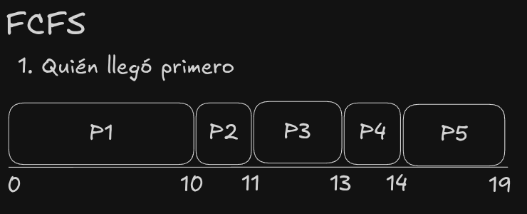
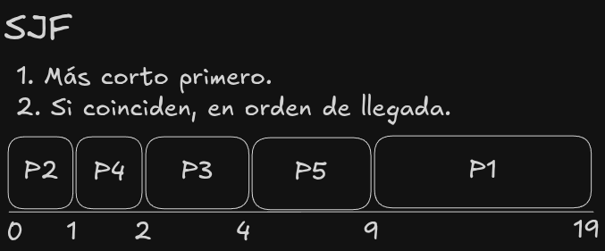
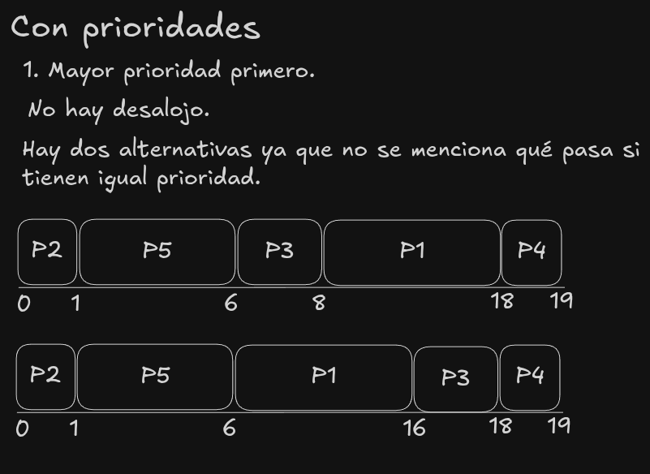
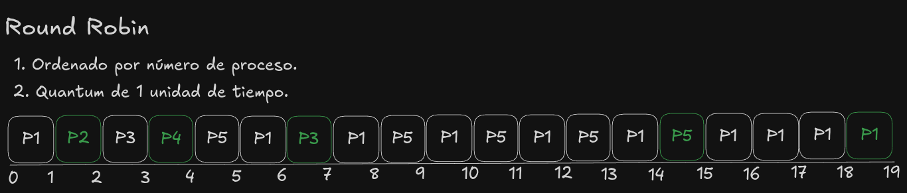

b)

Preguntar. No lo entendí bien. 

1) Creo que los cálculos están bien.
2) Creo que "con prioridades" tiene dos posibles ejecuciones.

3. FCFS
   1. Waiting Time Promedio: (0+10+11+13+14)/5 = 9.6
   2. Turn Around Promedio: (10+11+13+14+19)/5 = 13.4
4. SJF
   1. Waiting Time Promedio: (0+1+2+4+9)/5 = 3.2
   2. Turn Around Promedio: (1+2+4+9+19)/5 = 7
5. Con Prioridades (1)
   1. Waiting Time Promedio: (0+1+6+8+18)/5 = 6.6
   2. Turn Around Promedio: (1+6+8+18+19)/5 = 10.4  
6. Con Prioridades (2)
   1. Waiting Time Promedio: (0+1+6+16+18)/5 = 8.2
   2. Turn Around Promedio: (1+6+16+18+19)/5 = 12
7. Round Robin
   1. Waiting Time Promedio: (10+1+5+3+9)/5 = 5.6
   2. Turn Around Promedio: (19+2+7+4+15)/5 = 9.4

c) SJF. SJF.

## Ejercicio 7
El siguiente diagrama de Gantt corresponde a la ejecución tres procesos en un sistema monoprocesador.

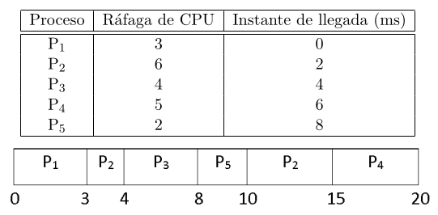

a) Calcular el waiting time y el turnaround promedios.

Turnaround: Tiempo de Finalización - Tiempo de Llegada.

- P1 = 3 - 0 = 3
- P2 = 15 - 2 = 13
- P3 = 8 - 4 = 4
- P4 = 20 - 6 = 14
- P5 = 10 - 8 = 2

Turnaround Promedio: (3+13+4+14+2) / 5 = 36 / 5 = 7.2

Waiting Time: TA - Tiempo de Ejecución.

- P1 = 3 - 3 = 0
- P2 = 13 - 6 = 7
- P3 = 4 - 4 = 0
- P4 = 14 - 5 = 9
- P5 = 2 - 2 = 0

Waiting Time Promedio: 16 / 5 = 3.2


b) Indicar de qué tipo de scheduler se trata, justificando claramente esa conclusión.

b)

* Llegan en orden: **P1, P2, P3, P4, P5**.

* Cómo se ejecutan:

  * **P1 se consume entero**, ya que necesita 3 ráfagas de CPU.

  * **P2 ya había llegado cuando P1 estaba ejecutando**, pero P1 continúa ejecutándose. P2 necesita 6 ráfagas de CPU y, cuando empieza a ejecutarse, consume 1, por lo que le quedan **5 ráfagas**.

    Hay dos posibilidades para explicar por qué P2 deja de ejecutar:

    * Lo desalojan porque llega un proceso que necesita menos ráfagas de CPU.
    * Se pone a hacer I/O.

    **La segunda posibilidad no la considero porque el enunciado no menciona ninguna operación de I/O.**

  * Luego **P3 se ejecuta entero**, ya que necesita 4 ráfagas de CPU.

  * **P4 llega mientras P3 está ejecutando**, pero termina siendo uno de los últimos en ejecutarse. Esto es llamativo porque P4 llega antes que P5, pero P5 se ejecuta primero. P5 necesita solamente **2 ráfagas de CPU**, mientras que a P2 le quedaban **5**, por lo que parece que se prioriza al proceso al que le quedan menos ráfagas de CPU.

  * Cuando P3 termina, quedan **P2, P4 y P5**. Se ejecutan en el orden **P5 → P2 → P4**. Esto tiene sentido si se prioriza al proceso que tiene menos CPU restante:

    * P5: **2 ráfagas**
    * P2: **5 ráfagas** restantes
    * P4: **5 ráfagas**

    P5 se ejecuta primero por ser el que menos CPU necesita. Luego hay un empate entre P2 y P4, y se ejecuta primero P2 porque **llegó antes que P4**.

Conclusión
* Es un **scheduler preemptive**, porque **P2 es desalojado antes de terminar** cuando aparece P3.

* P2 se desaloja en **t = 4**, después de haber consumido 1 ráfaga de CPU, porque llega P3, al que le quedan solamente **4 ráfagas**, mientras que a P2 le quedan **5**.

* Cuando quedan P2, P4 y P5, se ejecutan **P5 → P2 → P4**. P5 tiene menos CPU restante, mientras que P2 y P4 tienen la misma cantidad restante. En ese empate se prioriza al que **llegó primero**, por lo que P2 se ejecuta antes que P4.

**El algoritmo es SRTF (Shortest Remaining Time First), porque prioriza los procesos a los que les queda menos tiempo de CPU para terminar. Además, es la versión con desalojo, ya que cuando aparece un proceso con menor tiempo restante puede desalojar al proceso que está ejecutando. De no ser preemptive, P2 habría continuado ejecutándose hasta terminar.**


## Ejercicio 8
Para los procesos presentados en la siguiente tabla, realizar un gŕafico de Gantt para cada uno de los algoritmos de scheduling indicados:
- FCFS
- RR (quantum = 10)
- SJF

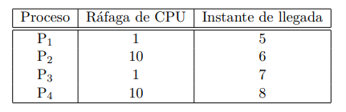

Luego, calcular el Turnaround y Waiting Time promedio

**Respuesta**

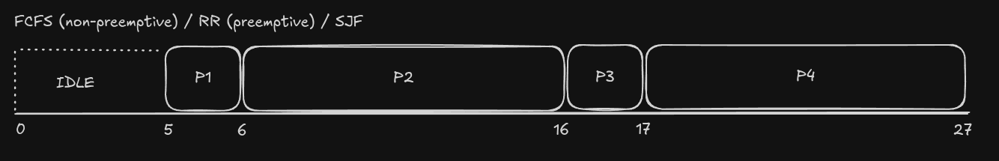

Los 3 quedan exactamente igual.

- FCFS es non-preemptive. Agarrás a medida que llegan y terminás.
- RR es preemptive pero da la casualidad que ninguno tiene más de 10 ráfagas. Entonces el que agarra, lo ejecuta entero.
- SJF es non-preemptive. Agarrás a medida que llegan y terminás. Si P3 hubiese llegado con P2, agarrarías P3 y después P2.

Este ejercicio no sé si está mal planteado o era la idea (?.

Turnaround Promedio: 

- P1: 6 - 5 = 1
- P2: 16 - 6 = 10
- P3: 17 - 7 = 10
- P4: 27 - 8 = 19

40 / 4 = 10.

Waiting Time Promedio:

- P1: 1 - 1 = 0
- P2: 10 - 10 = 0.
- P3: 10 - 1 = 9.
- P4: 19 - 10 = 9.

18 / 4 = 4.5

## Ejercicio 9
Considere los siguientes procesos

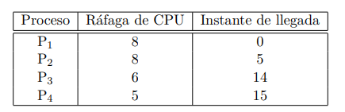

a) Realizar un diagrama de Gantt para un algoritmo de scheduling round-robin con un quantum de 5 unidades de tiempo.

b) Realizar un diagrama de Gantt para un algoritmo tipo shortest remaining time first.

c) Calcular el tiempo de turnaround promedio en ambos casos.

d) A pesar de que uno de los dos casos tiene un tiempo de turnaround promedio mucho menor, explicar por qué en algunos contextos podría tener sentido utilizar la otra política. Para esto
considere distintos tipos de procesos: real time, interactivos, batch, etc.

**Respuesta**

a) b) 
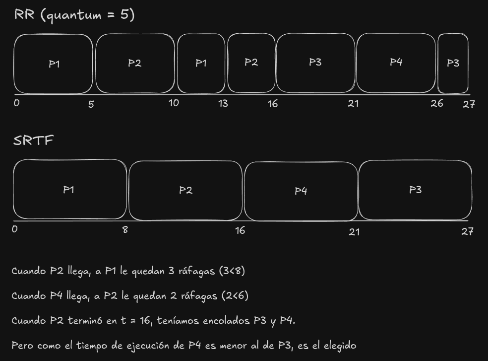

c) Lo hago en orden en el que estan los procesos en la tabla (P1, P2, P3, P4), no con respecto al dibujo.

Round-Robin:
- Turnaround Promedio: ((13-0) + (16-5) + (27 - 14) + (26 - 15)) / 4 = 48 / 4 = 12
- Waiting Time Promedio ((13-8) + (11-8) + (13-6) + (11-5)) / 4 = 21 / 4 = 5.25

SRTF:
- Turnaround Promedio: ((8-0) + (16-5) + (27 - 14) + (21-15)) / 4 = 38 / 4 = 9.5
- Waiting Time Promedio: ((8-8) + (11-8) + (13-6) + (6-5)) / 4 = 11 / 4 = 2.75

d) El algoritmo SRTF logra un menor Turnaround promedio al priorizar siempre el trabajo más corto. Sin embargo, hay algunas contras a este

- Procesos Interactivos: Requieren tiempos de respuesta bajos e inmediatos (atender eventos de interfaz, entrada de usuario, etc.). SRTF no garantiza un tiempo de respuesta equitativo; si se ejecuta un proceso largo, los demás deben esperar a que este termine o reduzca su tiempo restante. Round-Robin intercala la CPU entre todos los procesos activos de forma equitativa mediante el quantum, garantizando que ningun proceso interactivo sufra latencias perceptibles para el usuario.

- Procesos Batch (por lotes): Son tareas largas que no requieren interacción directa. Si se utiliza SRTF en un entorno con un flujo continuo de procesos interactivos cortos, el proceso Batch sufrirá de inanición (starvation), quedando postergado indefinidamente. Round-Robin evita este problema asegurando que, tarde o temprano, todo proceso reciba tiempo de CPU.

- Procesos en Tiempo Real (Real-Time): Ninguna de estas dos políticas es óptima para este contexto. Los sistemas de tiempo real no buscan priorizar el tiempo de retorno ni la equidad, sino el cumplimiento estricto de límites de tiempo (deadlines). Por ello, se utilizan algoritmos especializados como EDF (Earliest Deadline First) o RMS (Rate Monotonic Scheduling), donde ignorar un deadline puede ser crítico para el sistema.

Conclusión: SRTF es una política idealmente teórica que requiere conocer el tiempo futuro de ejecución de los procesos (lo cual es inviable en la práctica) y genera inequidad. Round-Robin es la alternativa estándar para sistemas multiusuario y de propósito general por su equidad y buen tiempo de respuesta.

## Ejercicio 10
Considere los siguientes procesos
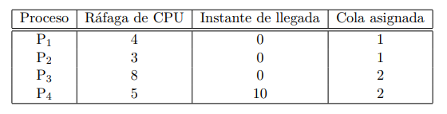

a) Realizar un diagrama de Gantt para un algoritmo de scheduling Multilevel feedback queue con dos colas: una cola 1 con quantum de 1 unidad de tiempo, y una cola 2 con FCFS. 

La cola 1 tiene más prioridad que la 2. Usa política con desalojo. 

Para cada proceso se indica qué cola se le asigna en el momento de su llegada.

b) Calcular el tiempo de turnaround promedio y el waiting time promedio.

**Respuesta**

Algunas aclaraciones:

- "Una cola 1 con quantum de 1 unidad de tiempo": se refiere a Round Robin con quantum de t = 1.
- **Preguntar**: "Usa política con desalojo". ¿siempre que caiga algo en una queue de mayor prioridad se prioriza esa? Esta pregunta está porque, está en el mismo párrafo que "la cola 1 tiene más prioridad que la 2" y no creo que el "Usa política con desalojo" esté relacionado a una queue en particular.

Entonces:

- Queue 1: RR (quantum 1)
- Queue 2: FCFS

Para cada proceso, se dice a qué queue cae. 

a) Primero, tenemos que resolver todos los de la queue 1. Como ninguno tiene que hacer I/O, sabemos que vamos a alternar entre todos ellos con q = 1. Una vez que terminamos con los de la queue 1, vamos con los de la queue 2 en el orden en que entraron (FCFS) 
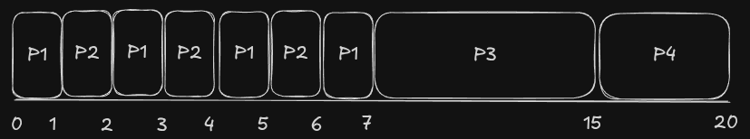

b) 

Turnaround promedio: ((7-0) + (6-0) + (15-0) + (20-10)) / 4 = (7 + 6 + 15 + 10) / 4 =  38 / 4 = 9.5

Waiting Time promedio: ((7-4) + (6-3) + (15-8) + (10-5)) / 4 = 4.5

## Ejercicio 11
Considere un algoritmo de scheduling que favorece a aquellos procesos que han usado la menor
cantidad de tiempo de procesador en el pasado reciente. Explique por qué favorecería a los procesos
que realizan muchas E/S, pero a la vez no dejaría a los intensivos en CPU en starvation.

**Respuesta**: el algoritmo favorece a los procesos que realizan mucha E/S porque estos procesos suelen alternar ráfagas cortas de CPU con períodos de E/S. Por lo tanto, cuando vuelven al estado listo, han utilizado poca CPU en el pasado reciente y reciben una mayor prioridad que los procesos intensivos en CPU, que suelen acumular un mayor uso reciente del procesador.

A su vez, los procesos intensivos en CPU no sufren starvation porque la prioridad depende del uso reciente de CPU y no de su uso acumulado desde que comenzó el proceso. Si un proceso CPU-bound permanece esperando, deja de consumir CPU mientras otros procesos ejecutan. Por lo tanto, con el paso del tiempo, los demás procesos acumulan uso reciente de CPU mientras él no lo hace, haciendo que eventualmente también sea favorecido por el scheduler.

Lo clave acá es el pasado reciente: si no tenés mucho uso de CPU en el pasado reciente, se te prioriza más, seas un proceso CPU-bound o I/O-bound. Esto genera un efecto de aging, que evita que los procesos CPU-bound queden indefinidamente postergados.

## Ejercicio 12
Considere los siguientes procesos:
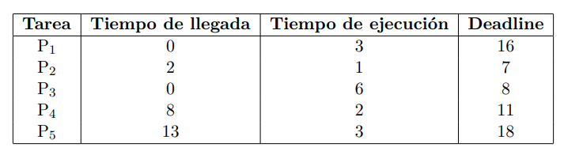

a) Para los procesos presentados en la siguiente tabla, realizar un gráfico de Gantt usando el algoritmo de EDF (Earliest Deadline First).

b) Calcular Turnaround promedio.

c) Calcular waiting time promedio

**Respuesta**

Antes de empezar recordemos qué tipo de algoritmo es EDF. 

EDF es un algoritmo preemptive de scheduling en tiempo real donde se prioriza ejecutar la tarea con el deadline más próximo. Cada vez que entra una nueva tarea se hace esa consulta: "la tarea que entró tiene un deadline más próximo que la actual? si la respuesta es: "sí", entonces switchea".

a) Voy a primero comentar como va sucediendo todo, y luego hago el diagrama de Gantt.

* **t = 0:** Llegan $P_1$ ($t.e = 3, d = 16$) y $P_3$ ($t.e = 6, d = 8$). Como $d(P_3) < d(P_1)$, ejecuta **$P_3$**.
* **t = 1:** Ejecuta $P_3$ (1 u.t.). Estado: $P_3$ ($t.e = 5, d = 8$), $P_1$ ($t.e = 3, d = 16$). Continúa **$P_3$**.
* **t = 2:** Ejecuta $P_3$ (1 u.t.). Llega $P_2$ ($t.e = 1, d = 7$). Como $d(P_2) < d(P_3)$, $P_2$ desaloja a $P_3$. Estado: $P_2$ ($t.e = 1, d = 7$), $P_3$ ($t.e = 4, d = 8$), $P_1$ ($t.e = 3, d = 16$). Ejecuta **$P_2$**.
* **t = 3:** Ejecuta $P_2$ (1 u.t.) y **termina**. Se retoma $P_3$ por tener menor deadline que $P_1$. Estado: $P_3$ ($t.e = 4, d = 8$), $P_1$ ($t.e = 3, d = 16$). Ejecuta **$P_3$**.
* **t = 4:** Ejecuta $P_3$ (1 u.t.). Estado: $P_3$ ($t.e = 3, d = 8$), $P_1$ ($t.e = 3, d = 16$). Continúa **$P_3$**.
* **t = 5:** Ejecuta $P_3$ (1 u.t.). Estado: $P_3$ ($t.e = 2, d = 8$), $P_1$ ($t.e = 3, d = 16$). Continúa **$P_3$**.
* **t = 6:** Ejecuta $P_3$ (1 u.t.). Estado: $P_3$ ($t.e = 1, d = 8$), $P_1$ ($t.e = 3, d = 16$). Continúa **$P_3$**.
* **t = 7:** Ejecuta $P_3$ (1 u.t.) y **termina**. Comienza a ejecutar $P_1$. Estado: $P_1$ ($t.e = 3, d = 16$). Ejecuta **$P_1$**.
* **t = 8:** Ejecuta $P_1$ (1 u.t.). Llega $P_4$ ($t.e = 2, d = 11$). Como $d(P_4) < d(P_1)$, $P_4$ desaloja a $P_1$. Estado: $P_4$ ($t.e = 2, d = 11$), $P_1$ ($t.e = 2, d = 16$). Ejecuta **$P_4$**.
* **t = 9:** Ejecuta $P_4$ (1 u.t.). Estado: $P_4$ ($t.e = 1, d = 11$), $P_1$ ($t.e = 2, d = 16$). Continúa **$P_4$**.
* **t = 10:** Ejecuta $P_4$ (1 u.t.) y **termina**. Se retoma $P_1$. Estado: $P_1$ ($t.e = 2, d = 16$). Ejecuta **$P_1$**.
* **t = 11:** Ejecuta $P_1$ (1 u.t.). Estado: $P_1$ ($t.e = 1, d = 16$). Continúa **$P_1$**.
* **t = 12:** Ejecuta $P_1$ (1 u.t.) y **termina**. La CPU entra en estado **IDLE**.
* **t = 13:** Fin de período IDLE. Llega $P_5$ ($t.e = 3, d = 18$) y comienza a ejecutar.

b) Turnaround promedio: es la suma de los TAT de todos los procesos dividido por la cantidad total de procesos.

TAT = Tiempo de Finalización - Tiempo de Llegada

- P1 = 12 - 0 = 12
- P2 = 3 - 2 = 1
- P3 = 7 - 0 = 7
- P4 = 10 - 8 = 2
- P5 = 16 - 13 = 3


**Turnaround promedio** = (12 + 1 + 7 + 2 + 3) / 5 = 25 / 5 = 5 unidades de tiempo

c) Waiting Time promedio: es el tiempo total que un proceso pasa en la cola de listos esperando usar la CPU.

WT = TAT - Tiempo de Ejecución

- P1 = 12 - 3 = 9
- P2 = 1 - 1 = 0
- P3 = 7 - 6 = 1 
- P4 = 2 - 2 = 0 
- P5 = 3 - 3 = 0

**Waiting Time promedio** = 10 / 5 = 2 unidades de tiempo

Notar que los que tienen 0 es porque al toque que llegaron, le dimos el control y no fueron desalojados porque no llegó otro con deadline menor hasta que terminaron.

